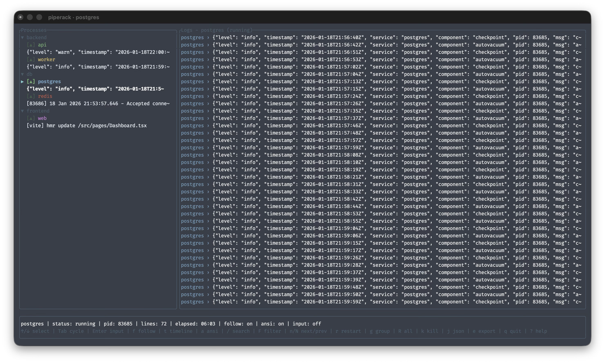

# Piperack

**Run concurrent commands without turning your terminal into a crime scene.**



Stop juggling terminal tabs. Stop squinting at interleaved logs where a stack trace from your API gets mixed with Webpack build noise. If you are still running `npm-run-all` or `concurrently` and hoping for the best, you are wasting your time deciphering chaos. Concurrency is not the problem. Unreadable output is.

Piperack fixes this. It replaces your fragile manual workflow with a deterministic, structured TUI. One command. Zero headaches.

 

## Install (Homebrew)

```bash
brew tap pipe-rack/homebrew-tap
brew install pipe-rack/homebrew-tap/piperack
```

**Prefixing lines is not observability.**

Most process runners are just `&` wrapped in a runtime. They dump stdout to your console and let you figure it out. Piperack ingests logs into structured buffers, giving you a dedicated view for every process.

## Parallel logs don’t need to be interleaved.

Piperack is a single binary that treats your local environment like a production cluster.

- **Native Performance:** Written in Rust. ~3k LOC. No daemon. No plugins. No `node_modules` black hole required just to run a script.
- **Real Orchestration:** Define `depends_on` and `ready_check` policies. Services start when they are actually ready, not when you "feel like it."
- **Intelligent TUI:** Filter (`F`), search (`/`), and format JSON (`j`) in real-time. Don't just tail logs—interact with them.
- **Structured Data:** Your logs are JSON. Piperack knows that. It parses and pretty-prints them automatically.

## Quick Start

Inline for speed:

```bash
piperack --name api -- cargo run --name web -- pnpm dev
```

Configured for sanity:

```bash
piperack --config examples/full_stack.toml
```

## Documentation

- [Installation](docs/installation.md)
- [Usage](docs/usage.md)
- [Configuration](docs/configuration.md)
- [Architecture](docs/architecture.md)
- [Testing](docs/testing.md)

## Configuration

No config DSL. Just type-safe TOML.

> **Tip:** Use the official Gemini CLI skill to generate this automatically: `npx skills add pipe-rack/skills`.

```toml
# piperack.toml
# Defaults that make sense.
prefix_colors = true
log_file = "logs/{name}.log"

# 1. Database
[[process]]
name = "postgres"
cmd = "docker run --rm -p 5432:5432 postgres"
tags = ["db", "backend"]
# Stop guessing. Check.
ready_check = { log = "database system is ready to accept connections" }

# 2. Redis
[[process]]
name = "redis"
cmd = "redis-server"
tags = ["db", "cache"]
ready_check = { tcp = 6379 }

# 3. API
[[process]]
name = "api"
cmd = "go run main.go"
tags = ["backend"]
# Block startup until dependencies are healthy.
depends_on = ["postgres", "redis"]
watch = ["*.go"] 
json_log = true

# 4. Frontend
[[process]]
name = "web"
cmd = "pnpm dev"
tags = ["frontend"]
depends_on = ["api"]
```

## Controls

Your terminal can handle more than stdout.

| Key | Action |
| :--- | :--- |
| `?` | Toggle Help |
| `/` | **Search** (Live highlight matches) |
| `F` | **Filter** (Show only matching lines) |
| `j` | **JSON Mode** (Toggle pretty-printing) |
| `t` | **Timeline** (View merged output context) |
| `g` | **Group Restart** (Restart by tag) |
| `Mouse` | Select process & scroll logs |


## Contributing

We built this because we were tired of bad tools. If you want to improve Piperack, keep it fast, keep it safe, and keep it idiomatic.

This is a tool, not a product.

1. Fork it.
2. Branch it.
3. PR it.
